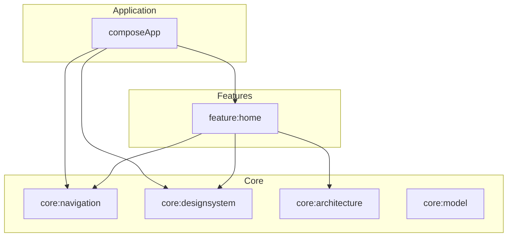
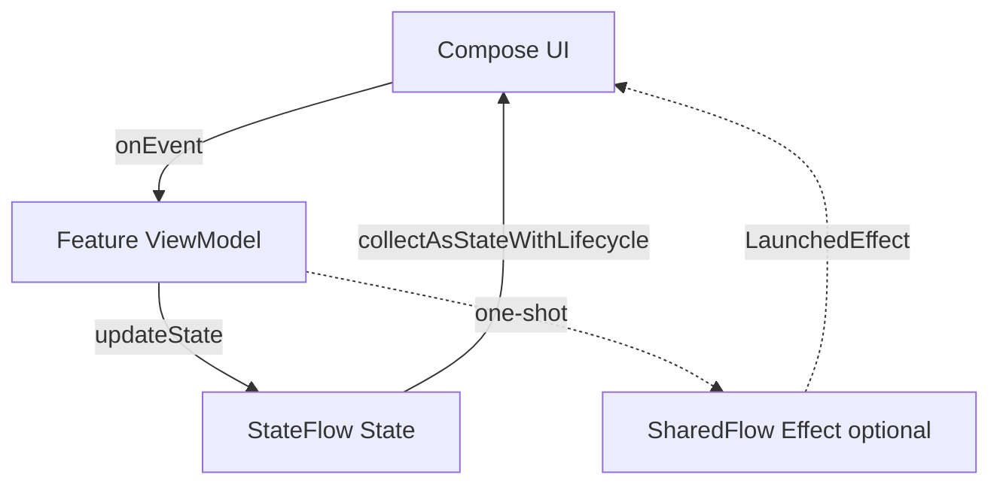
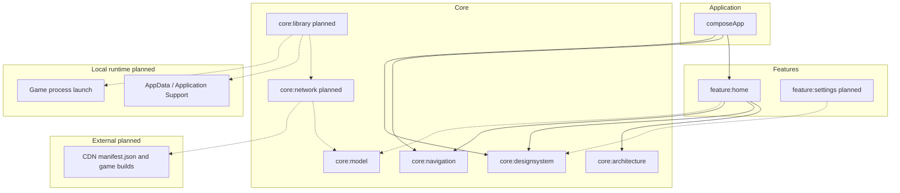

# Game Launcher

Cross-platform desktop game launcher for **Windows** and **macOS**, built with Kotlin Multiplatform and Compose Multiplatform.

Current stage: modular desktop shell with a Hello World home screen. Backend CDN, manifest fetching, downloads, and game launch are planned in later issues.

## Repository layout

```
GameLauncher/
├── launcher/          # KMP desktop app (Gradle project)
│   └── scripts/       # Launcher-specific helpers (ktlint)
├── manifests/       # Catalog manifest (git → CI → R2)
├── tools/
│   ├── deploy/      # R2 CDN upload (rclone) — see tools/deploy/README.md
│   └── dev/         # Secret scan, GitHub PAT helpers
├── .github/         # CI workflows
└── .cursor/         # Agent skills, rules, hooks
```

| Folder | What lives here |
|--------|-----------------|
| [`manifests/`](manifests/) | Catalog manifest JSON — deployed to R2 on push to `main` |
| [`launcher/`](launcher/) | Compose Multiplatform app — run and package from here |
| [`tools/deploy/`](tools/deploy/) | Terminal deploy to Cloudflare R2 |
| [`tools/dev/`](tools/dev/) | Contributor scripts (not shipped with the app) |

## Local setup

### Prerequisites

| Requirement | Notes |
|-------------|--------|
| **JDK 17+** | Required for Compose Desktop and native packaging. Verify with `java -version`. |
| **Git** | To clone the repository. |

No API keys, CDN credentials, or GitHub tokens are needed to run the app locally at this stage.

### Run from the terminal

```bash
git clone https://github.com/morphingcoffee/GameLauncher.git
cd GameLauncher/launcher
./gradlew :composeApp:run
```

First run downloads Gradle dependencies and may take a few minutes.

### Run from the IDE

1. Open the **`launcher/`** directory in **Android Studio** or **IntelliJ IDEA** with the **Kotlin Multiplatform** plugin.
2. Wait for Gradle sync to finish (Android SDK via `launcher/local.properties` is required for the `androidTarget` used by Compose previews).
3. Run the **`composeApp`** desktop configuration, or execute `:composeApp:run`.

### Compose previews

`@Preview` composables in `commonMain` render in Android Studio when the **Kotlin Multiplatform** plugin is enabled. Modules include an `androidTarget` (library stub) to power the Android preview tooling; desktop remains the primary ship target (macOS / Windows).

If no run configuration appears for desktop-only projects, create a **Gradle** run config with task `:composeApp:run`.

### Optional (contributors)

Enable project git hooks for secret scanning before commit/push:

```bash
git config core.hooksPath .githooks
```

See [`.cursor/skills/secret-hygiene/SKILL.md`](.cursor/skills/secret-hygiene/SKILL.md) for GitHub MCP and Keychain setup (not required to run the launcher).

### Build installers

Requires a **full JDK 17+** with `jpackage` (e.g. Temurin). Android Studio’s bundled JBR does not include `jpackage`.

```bash
cd launcher

# macOS — Apple Silicon (default on M-series Macs)
./gradlew :composeApp:packageDmg

# macOS — Intel (use an x64 JDK; on Apple Silicon, run under Rosetta)
JAVA_HOME=/path/to/x64-jdk/Contents/Home ./gradlew :composeApp:packageDmg -PcomposeDesktopHost=macos-x64

# Windows (WiX Toolset 3.11+ required)
./gradlew :composeApp:packageMsi
```

### CI artifacts

Desktop installers are built **on demand** via [`.github/workflows/desktop-installers.yml`](.github/workflows/desktop-installers.yml) — they do not run on every push or pull request.

1. Open **Actions** → **Desktop installers** → **Run workflow**
2. Choose branch (default `main`), optionally disable macOS or Windows
3. Download from the run → **Artifacts**

| Runner | Artifacts |
|--------|-----------|
| `macos-latest` (arm64 JDK) | `GameLauncher-{version}-macos-arm64.dmg`, `GameLauncher-{version}-macos-arm64.zip` |
| `macos-latest` (x64 JDK) | `GameLauncher-{version}-macos-x64.dmg`, `GameLauncher-{version}-macos-x64.zip` |
| `windows-latest` | `GameLauncher-{version}.msi` (GitHub artifact name `GameLauncher-windows-{version}`) |

`{version}` is the marketing `packageVersion` (`0.0.1`) plus a CI build suffix when built via Actions: `0.0.1-build{run}` (see `printArtifactVersion` in [`launcher/composeApp/build.gradle.kts`](launcher/composeApp/build.gradle.kts)). macOS and Windows jobs from the same workflow run share `{run}` (`github.run_number` passed as `-PbuildNumber`).

**macOS:** GitHub adds a quarantine flag. After download, run `xattr -cr GameLauncher.app` (or the app inside the mounted DMG), then open normally. Developer ID signing/notarization is tracked in [#9](https://github.com/morphingcoffee/GameLauncher/issues/9). CI embeds the build number in `CFBundleVersion`.

**Windows:** SmartScreen may warn about an unknown publisher — use **More info** → **Run anyway**.

After install, search Start for **Game Launcher**; a desktop shortcut is created by default. To upgrade, run a newer MSI over the existing install (no uninstall required). CI sets `-PbuildNumber` from the workflow run; Windows maps it to MSI product version `1.0.<build>`, macOS to `CFBundleVersion`. Local builds omit `-PbuildNumber` (MSI product version `1.0.0`). Rebuild-over-install locally may require uninstalling first or passing `-PbuildNumber=<n>`. MSIs produced before [#37](https://github.com/morphingcoffee/GameLauncher/issues/37) may need a one-time uninstall before upgrading.

---

## Architecture

### Module layers

Modules are split by responsibility. Features depend on core libraries; the app module wires everything together.



| Module | Role |
|--------|------|
| `:composeApp` | Desktop entry point, Koin bootstrap, root Navigation 3 host, packaging |
| `:feature:home` | Home screen vertical slice (MVI contract + UI) |
| `:core:navigation` | Typed `AppDestination` keys and nav serialization config |
| `:core:designsystem` | Shared theme and Compose primitives |
| `:core:architecture` | Lightweight `MviViewModel` base (no business logic) |
| `:core:model` | Manifest and version-index JSON models, platform keys |

**Dependency rules:** features never depend on `:composeApp`; core modules never depend on features.

### Unidirectional data flow (MVI)

Each feature owns a small contract: `State`, `Event`, and optional `Effect`. The UI sends events; the ViewModel updates state; Compose observes `StateFlow`.



We deliberately avoid reducers, middleware, or a global MVI framework until a feature needs them.

### Key technical decisions

| Area | Choice | Rationale |
|------|--------|-----------|
| UI | Compose Multiplatform 1.11 (desktop JVM) | Shared UI for Windows and macOS from `commonMain` |
| Language | Kotlin 2.3.20+ | Aligns with Koin Compiler Plugin requirements |
| State | Lightweight MVI + `StateFlow` | Clear UDF without ceremony |
| DI | Koin 4.2 + Compiler Plugin (`compileSafety`) | Multiplatform-friendly; graph validated at compile time |
| Navigation | Navigation 3 (`NavKey` back stack) | Compose-first, multiplatform-safe typed routes |
| Serialization | kotlinx.serialization | Nav keys now; manifest JSON in a later phase |

### Full system view (current + planned)

Diagrams use [Mermaid](https://mermaid.js.org/) — the same format Cursor Plan mode renders inline (pan, zoom, fullscreen). GitHub also renders these blocks in the README. Extend this diagram as backends and CDN land; use `flowchart TB` (top-down), not left-right layouts.



Dashed edges (`-.->`) mark planned wiring. Solid edges are implemented today.

---

## Launcher modules (`launcher/`)

```
launcher/
  composeApp/          Desktop app entry + DI bootstrap
  core/
    architecture/      MVI primitives
    designsystem/      Theme and shared UI
    navigation/        Navigation 3 destinations
  feature/
    home/              Home feature slice
  scripts/             ktlint and other launcher helpers
```

---

## License

See [LICENSE](LICENSE).
