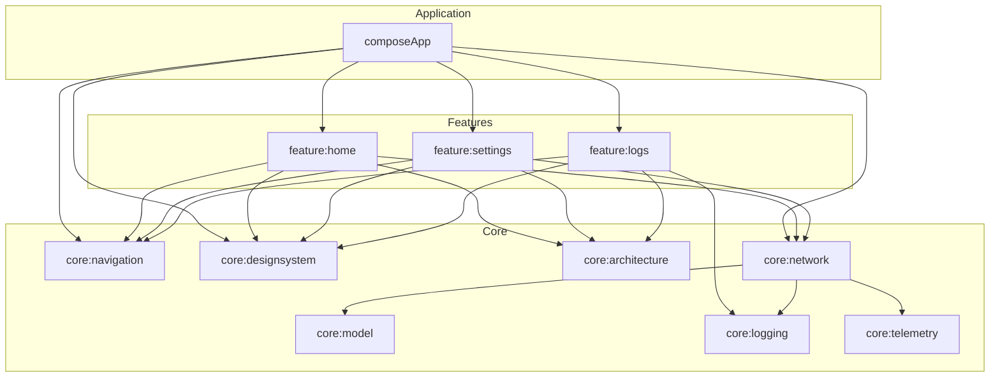
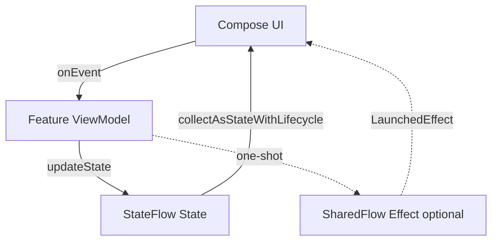

# Game Launcher

Cross-platform desktop game launcher for **Windows** and **macOS**, built with Kotlin Multiplatform and Compose Multiplatform.

The app fetches a remote game catalog from Cloudflare R2, installs and launches games, manages local storage, shows logs, and supports launcher self-update across MSI / portable ZIP / DMG channels.

## Repository layout

```
GameLauncher/
├── launcher/          # KMP desktop app (Gradle project)
│   ├── composeApp/    # Desktop entry, DI, Navigation 3 host, packaging
│   ├── core/          # architecture, designsystem, model, navigation, network, logging, telemetry
│   ├── feature/       # home, settings, logs
│   └── scripts/       # Launcher-specific helpers (ktlint)
├── manifests/         # Catalog manifest (git → CI → R2)
├── r2_staging/        # Gitignored local R2 mirror — see r2_staging/README.md
├── tools/
│   ├── deploy/        # R2 CDN upload — see tools/deploy/README.md
│   └── dev/           # Secret scan, GitHub PAT helpers
├── .github/           # CI workflows
└── .cursor/           # Agent skills, rules, hooks
```

| Folder | What lives here |
|--------|-----------------|
| [`manifests/`](manifests/) | Catalog manifest JSON — deployed to R2 on push to `main` |
| [`launcher/`](launcher/) | Compose Multiplatform app — run and package from here |
| [`r2_staging/`](r2_staging/) | Local binary staging that mirrors R2 object keys |
| [`tools/deploy/`](tools/deploy/) | Terminal deploy to Cloudflare R2 |
| [`tools/dev/`](tools/dev/) | Contributor scripts (not shipped with the app) |

R2 / catalog publish recipes live in [`tools/deploy/README.md`](tools/deploy/README.md).

## Local setup

### Prerequisites

| Requirement | Notes |
|-------------|--------|
| **JDK 25 (Temurin)** | Required for Compose Desktop, CI, and native packaging (`jpackage`). Kotlin/Java **bytecode target stays 17**. Verify with `java -version` (CI uses Temurin 25). |
| **Android SDK (API 37.0)** | Needed for `./gradlew build` / Android Studio sync — install **Android SDK Platform 37.0** (SDK Manager). CMP 1.12 AndroidX deps require `compileSdk` 37 with `minorApiLevel = 0` (package dir `platforms/android-37.0`). Point `ANDROID_HOME` at the SDK, or set `sdk.dir` in `launcher/local.properties` (gitignored). |
| **Python 3** | Stdlib only — used by deploy tooling unit tests and offline catalog validation. |
| **Git** | To clone the repository. |

No API keys, CDN credentials, or GitHub tokens are needed to run the app or the local verify script.

### Verify (same checks as CI)

From the **repository root**, run the canonical verification script (Gradle build + ktlint, Python unit tests, offline catalog validation):

```bash
./tools/dev/verify.sh
```

Or run the same steps manually:

```bash
# Gradle root is launcher/ (not the repo root)
cd launcher
./gradlew build ktlintCheck --warning-mode all

cd ../tools/deploy
python3 -m unittest discover -s tests -v

cd ../..
python3 tools/deploy/r2_catalog_check.py --offline
```

GitHub Actions runs these checks on every pull request and every push to `main` via [`.github/workflows/ci.yml`](.github/workflows/ci.yml) (check name: **CI**).

### Run from the terminal

```bash
git clone https://github.com/morphingcoffee/GameLauncher.git
cd GameLauncher/launcher
./gradlew :composeApp:run
```

Dev catalog (fake in-process games, simulated delays): `./gradlew :composeApp:runDevDesktop`.

First run downloads Gradle dependencies and may take a few minutes.

### Run from the IDE

1. Open the **`launcher/`** directory in **Android Studio** or **IntelliJ IDEA** with the **Kotlin Multiplatform** plugin.
2. Wait for Gradle sync to finish (Android SDK via `launcher/local.properties` is required for the Android KMP library target used by Compose previews).
3. Run the **`composeApp`** desktop configuration, or execute `:composeApp:run`.

### Compose previews

`@Preview` composables in `commonMain` render in Android Studio when the **Kotlin Multiplatform** plugin is enabled. Modules use AGP’s `com.android.kotlin.multiplatform.library` target (library stub) to power Android preview tooling; desktop remains the primary ship target (macOS / Windows).

If no run configuration appears for desktop-only projects, create a **Gradle** run config with task `:composeApp:run`.

### Optional (contributors)

Enable project git hooks for secret scanning before commit/push:

```bash
git config core.hooksPath .githooks
```

See [`.cursor/skills/secret-hygiene/SKILL.md`](.cursor/skills/secret-hygiene/SKILL.md) for GitHub MCP and Keychain setup (not required to run the launcher).

### Build installers

Requires a **full JDK 25** with `jpackage` (e.g. Temurin 25). Android Studio’s bundled JBR does not include `jpackage`.

```bash
cd launcher

# macOS — Apple Silicon (default on M-series Macs)
./gradlew :composeApp:packageDmg

# macOS — Intel (use an x64 JDK; on Apple Silicon, run under Rosetta)
JAVA_HOME=/path/to/x64-jdk/Contents/Home ./gradlew :composeApp:packageDmg -PcomposeDesktopHost=macos-x64

# Windows (WiX Toolset 3.11+ required) — MSI installer with branded WiX UI
pwsh ../tools/dev/package-windows-msi.ps1 -BuildNumber 1

# Windows portable ZIP — unzip GameLauncher-{version}/GameLauncher.exe (no installer)
pwsh ../tools/dev/package-windows-zip.ps1 -BuildNumber 1

# Or Gradle only (shortcuts/upgrade UUID; no custom WiX banner/dialog)
./gradlew :composeApp:packageMsi
```

### CI artifacts

Desktop installers are built **on demand** via [`.github/workflows/desktop-installers.yml`](.github/workflows/desktop-installers.yml) — they do not run on every push or pull request.

1. Open **Actions** → **Desktop installers** → **Run workflow**
2. Choose branch (default `main`); **each checkbox = exactly one build job** (name matches the job in the run list)
3. Download from the run → **Artifacts**

**Default run (prod only):** four build jobs — Windows MSI (prod), Windows portable ZIP (prod), macOS arm64 DMG (prod), macOS x64 DMG (prod). Dev checkboxes default off.

**Publish to R2** is a separate workflow: **Actions → Publish launcher release** — pass the **run ID** from a successful Desktop installers run. By default **Require all four prod channels** is on (full cross-platform release); turn it off to publish only the prod artifacts present in that build run. The workflow uploads blobs, commits `manifests/manifest.json`, and publishes to R2. Full channel/flag detail: [`tools/deploy/README.md`](tools/deploy/README.md).

| Runner | Artifacts |
|--------|-----------|
| `macos-latest` (arm64 JDK) | `GameLauncher-{version}-macos-arm64.dmg` |
| `macos-latest` (x64 JDK) | `GameLauncher-{version}-macos-x64.dmg` |
| `windows-latest` (MSI, prod) | `GameLauncher-{version}.msi` |
| `windows-latest` (portable ZIP, prod) | `GameLauncher-{version}.zip` |

`{version}` is the marketing `packageVersion` (`0.0.1`) plus a CI build suffix when built via Actions: `0.0.1-build{run}` (see `printArtifactVersion` in [`launcher/composeApp/build.gradle.kts`](launcher/composeApp/build.gradle.kts)). macOS and Windows jobs from the same workflow run share `{run}` (`github.run_number` passed as `-PbuildNumber`).

**macOS:** GitHub adds a quarantine flag. After download, mount the DMG, then run `xattr -cr` on the copied `.app` before opening. Developer ID signing/notarization is tracked in [#9](https://github.com/morphingcoffee/GameLauncher/issues/9). CI embeds the build number in `CFBundleVersion`.

**Windows MSI:** SmartScreen may warn about an unknown publisher — use **More info** → **Run anyway**. Authenticode signing is tracked in [#45](https://github.com/morphingcoffee/GameLauncher/issues/45).

**Windows portable ZIP:** CI builds via [`tools/dev/package-windows-zip.ps1`](tools/dev/package-windows-zip.ps1) — unzip `GameLauncher-{version}.zip` to get `GameLauncher-{version}/GameLauncher.exe` (separate workflow checkbox; no WiX required).

After install, search Start for **Game Launcher**; a desktop shortcut is created by default. CI builds the MSI via [`tools/dev/package-windows-msi.ps1`](tools/dev/package-windows-msi.ps1) (custom WiX banner/dialog, icon, and properties from [`launcher/composeApp/installer/windows/msi/`](launcher/composeApp/installer/windows/msi/); welcome copy in `installer-license.rtf`). Regenerate installer BMPs with `python3 launcher/composeApp/installer/windows/msi/generate-installer-bitmaps.py` (requires Pillow). Gradle `:composeApp:packageMsi` does not pass `--resource-dir`.

Uninstalling the MSI removes the app under Program Files but **not** downloaded games in `%APPDATA%\GameLauncher`.

To upgrade, run a newer MSI over the existing install (no uninstall required). CI sets `-PbuildNumber` from the workflow run; Windows maps it to MSI product version `1.0.<build>`, macOS to `CFBundleVersion`. Local builds omit `-PbuildNumber` (MSI product version `1.0.0`). Rebuild-over-install locally may require uninstalling first or passing `-PbuildNumber=<n>`. MSIs produced before [#37](https://github.com/morphingcoffee/GameLauncher/issues/37) may need a one-time uninstall before upgrading.

---

## Architecture

### Module layers

Modules are split by responsibility. Features depend on core libraries; `:composeApp` wires navigation and DI. Destinations today: `Home`, `Settings`, `Storage`, `Logs` (`AppDestination` in `:core:navigation`).


```mermaid
flowchart TB
  subgraph app_layer [Application]
    composeApp[composeApp]
  end

  subgraph feature_layer [Features]
    home[feature:home]
    settings[feature:settings]
    logs[feature:logs]
  end

  subgraph core_layer [Core]
    nav[core:navigation]
    design[core:designsystem]
    arch[core:architecture]
    model[core:model]
    network[core:network]
    logging[core:logging]
    telemetry[core:telemetry]
  end

  composeApp --> home
  composeApp --> settings
  composeApp --> logs
  composeApp --> nav
  composeApp --> design
  composeApp --> network

  home --> arch
  home --> design
  home --> nav
  home --> network

  settings --> arch
  settings --> design
  settings --> nav
  settings --> network

  logs --> arch
  logs --> design
  logs --> nav
  logs --> logging

  network --> model
  network --> logging
  network --> telemetry
```

| Module | Role |
|--------|------|
| `:composeApp` | Desktop entry point, Koin bootstrap, root Navigation 3 host, packaging |
| `:feature:home` | Catalog UI — browse, download/install, launch, other versions |
| `:feature:settings` | Settings / About / Storage screens |
| `:feature:logs` | In-app log viewer |
| `:core:navigation` | Typed `AppDestination` keys and nav serialization config |
| `:core:designsystem` | Shared theme and Compose primitives |
| `:core:architecture` | Lightweight `MviViewModel` base (no business logic) |
| `:core:model` | Manifest and version-index JSON models, platform keys |
| `:core:network` | Catalog/manifest fetch, install, launch, launcher self-update, settings persistence |
| `:core:logging` | Structured app logging |
| `:core:telemetry` | Crash / telemetry preference storage |

**Dependency rules:** features never depend on `:composeApp`; core modules never depend on features. Install and launch live in `:core:network` (there is no `:core:library` module).

### Unidirectional data flow (MVI)

Each feature owns a small contract: `State`, `Event`, and optional `Effect`. The UI sends events; the ViewModel updates state; Compose observes `StateFlow`.


```mermaid
flowchart TB
  ui[Compose UI]
  vm[Feature ViewModel]
  state[StateFlow State]
  effects[SharedFlow Effect optional]

  ui -->|onEvent| vm
  vm -->|updateState| state
  state -->|collectAsStateWithLifecycle| ui
  vm -.->|one-shot| effects
  effects -.->|LaunchedEffect| ui
```

We deliberately avoid reducers, middleware, or a global MVI framework until a feature needs them.

### Key technical decisions

| Area | Choice | Rationale |
|------|--------|-----------|
| UI | Compose Multiplatform 1.12.0-beta03 (desktop JVM) | Shared UI for Windows and macOS from `commonMain`; beta risks noted below |
| Language | Kotlin 2.4.10 | Official KMP ceiling pairs with Gradle 9.5 / AGP 9.1 |
| State | Lightweight MVI + `StateFlow` | Clear UDF without ceremony |
| DI | Koin 4.2.2 + Compiler Plugin 1.0.2 | Features may enable `compileSafety`; `:composeApp` sets `compileSafety = false` for cross-module ViewModels (Koin #2404) |
| Navigation | Navigation 3 (`NavKey` back stack) | Compose-first, multiplatform-safe typed routes |
| Serialization | kotlinx.serialization | Nav keys and manifest / version-index wire models (`@SerialName` on every property) |
| Tooling | Gradle 9.5.0 · AGP 9.1.0 · Temurin 25 | Official Kotlin 2.4.10 KMP ceilings; bytecode target remains 17 |

**Compose Multiplatform beta:** UI is on **1.12.0-beta03** (Material3 **1.12.0-alpha03**). Expect occasional API/tooling churn until a stable 1.12 line; keep host-specific Skiko artifacts (`-PcomposeDesktopHost=…`) when packaging cross-arch macOS builds.

---

## License

See [LICENSE](LICENSE).
